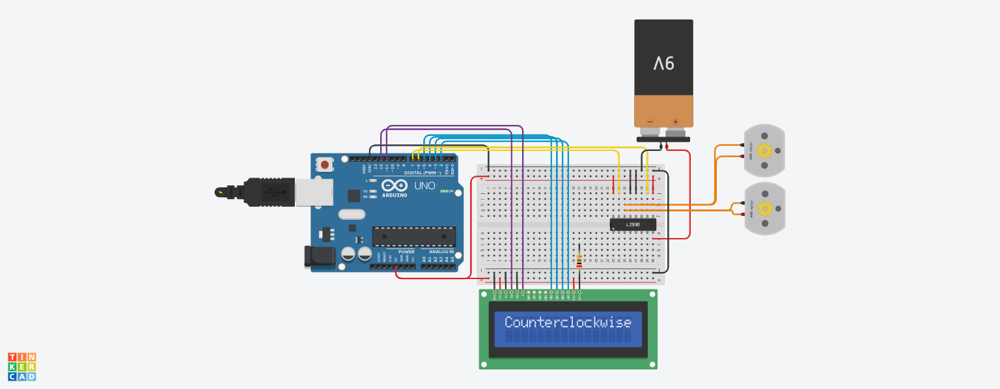

# DC MOTOR DIRECTION REVERSAL MONITOR



## [SCHEMATIC VIEW HERE!](assets/schematic.pdf)

## Project Description

This project, developed using the Tinkercad simulator, implements a motor control system with the following components: Arduino Uno, breadboard, LCD display, two DC motors, a 9-volt battery (powering the motors), an H-bridge L293D integrated circuit, and necessary connections. The L293D is employed to control the motors, rotating them in a clockwise direction for 2 seconds before reversing their direction to counterclockwise for another 2 seconds. Simultaneously, the Arduino controls the LCD display, which shows the current rotation direction of the motors as the sequence progresses.

The provided code utilizes the LiquidCrystal library to control an LCD display. It begins by initializing the LCD with the specified pins and setting up the output pins in the setup() function. The loop() function continuously executes the motor control and display sequence. It first clears the LCD and sets the digital pins to control the motors in a counterclockwise direction, displaying "Counterclockwise" on the LCD for 2 seconds. After this delay, the LCD is cleared again, and the motor direction is switched to clockwise, with the message "Clockwise" displayed for another 2 seconds. This cycle repeats indefinitely, allowing for continuous motor movement in alternating directions while providing visual feedback on the LCD.

## Components

- ( 1 ) Arduino Uno
- ( 1 ) Breadboard
- ( 1 ) 9-volt battery
- ( 1 ) H-bridge L293D
- ( 1 ) LCD display
- ( 2 ) DC motor
- ( 1 ) 200Ω Resistor

> Project Status: concluded


## Installation Guide

### Arduino IDE

To build and upload this project to your Arduino board, you'll need the Arduino IDE. Here's a quick installation guide:

1. **Download**: Go to the [Arduino IDE download page](https://www.arduino.cc/en/software) and download the installer for your operating system.
2. **Install**: Follow the installation instructions for your OS. Make sure to allow the installation of drivers if prompted.
3. **Setup**: Open the Arduino IDE and go to `File > Preferences` to configure any additional settings if needed.
4. **Add Board**: If you are using a board that requires additional configuration, go to `Tools > Board > Boards Manager` and install the necessary packages.

### Git

To manage version control and clone repositories, you'll need Git. Here's a quick installation guide:

1. **Download**: Visit the [Git website](https://git-scm.com/) and download the appropriate installer for your operating system.
2. **Install**: Run the installer and follow the setup instructions. You can choose the default options for most settings.
3. **Verify**: Open a terminal or command prompt and type `git --version` to ensure Git is installed correctly.

## Cloning the Repository

To clone this repository to your local machine, follow these steps:

1. **Open Terminal**: Open a terminal or command prompt on your machine.
2. **Clone Repository**: Use the following command to clone the repository:

   ```bash
   git clone https://github.com/HenriqueMelo2007/dc-motor-direction-reversal-monitor.git


## License

This project is licensed under the [MIT License/your chosen license]. You can find a copy of the license in the `LICENSE` file. 

### License Summary

- **Permission**: You are free to use, copy, modify, merge, publish, distribute, sublicense, and/or sell copies of the Software.
- **Conditions**: The above copyright notice and this permission notice must be included in all copies or substantial portions of the Software.
- **Disclaimer**: The software is provided "as is", without warranty of any kind. 

For more details, please refer to the full text of the license in the `LICENSE` file.   

## Contacts

📧 henriquemelo0983@gmail.com

💼 LinkedIn: [Henrique Melo](https://www.linkedin.com/in/henrique-de-oliveira-melo-933a41203/)